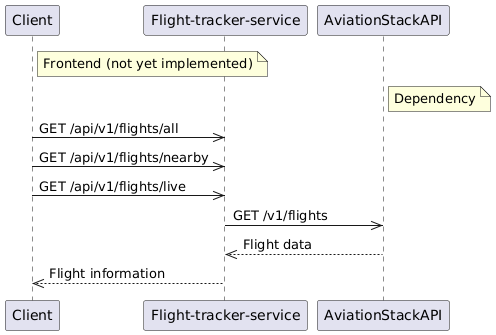

# Flight Radar API Documentation

## Intro to the project
Ongoing small API project to play around with Kotlin.
    Next steps:
        . Helm chart for deploying the app into local Kubernetes cluster
        . Build a FE with Next.js to display flight stats

## Overview

The Flight Radar API provides endpoints to retrieve flight information, including details about all flights and nearby flights based on geographical coordinates. The API is built with Kotlin and Spring Boot.

Flight Radar fetches the data from the Aviation Stack Api with a free account and with the following characteristics/constraints:
- Only data from 100 flights are provided
- Real-Time flights
- HTTPS Encryptions

## Prerequisites
- JDK 17
- Maven
## How to run the Application
1. Navigate to the project directory
2. Build the project using Maven
```
mvn clean install
```
3. Run the application
```
mvn spring-boot:run
```
or run the JAR from target folder:
```
java -jar target/flight-radar-service-0.0.1-SNAPSHOT.jar
```
## System 



## Endpoints

Once the application is running, the API is reachable in:
```
http://localhost:8080/api/v1/flights
```

### 1. Get All Flights

- **Endpoint:** `GET /api/v1/flights/all`
- **Description:** Retrieves a list of all current flights in the air.

#### Response

##### Successful Response
- Status Code: 200 OK
- Content-Type: application/json
- Response Body: The response is a JSON array containing FlightData objects for flights within the specified radius. Each object has the following structure:

##### Error Response
- Status Code: 400 Bad Request
- Reason: Missing or invalid parameters.
- Status Code: 404 Not Found
- Reason: No flights found within the specified radius.

```json
[
    {
        "flight_date": "YYYY-MM-DD",
        "flight_status": "scheduled | active | landed | cancelled | incident | diverted",
        "departure": {
            "airport": "Departure Airport Name",
            "timezone": "America/Los_Angeles",
            "iata": "IATA Code",
            "icao": "ICAO Code",
            "terminal": "Terminal Number",
            "gate": "Gate Number",
            "delay": 0,
            "scheduled": "2019-12-12T04:20:00+00:00",
            "estimated": "2019-12-12T04:20:00+00:00",
            "actual": "2019-12-12T04:20:00+00:00",
            "estimated_runway": "2019-12-12T04:20:00+00:00",
            "actual_runway": "2019-12-12T04:20:00+00:00"
        },
        "arrival": {
            "airport": "Arrival Airport Name",
            "timezone": "America/Los_Angeles",
            "iata": "IATA Code",
            "icao": "ICAO Code",
            "terminal": "Terminal Number",
            "gate": "Gate Number",
            "baggage": "Baggage Claim Gate",
            "delay": 0,
            "scheduled": "2019-12-12T04:20:00+00:00",
            "estimated": "2019-12-12T04:20:00+00:00",
            "actual": "2019-12-12T04:20:00+00:00",
            "estimated_runway": "2019-12-12T04:20:00+00:00",
            "actual_runway": "2019-12-12T04:20:00+00:00"
        },
        "airline": {
            "name": "Airline Name",
            "iata": "IATA Code",
            "icao": "ICAO Code"
        },
        "flight": {
            "number": "Flight Number",
            "iata": "IATA Flight Number",
            "icao": "ICAO Flight Number",
            "codeshared": null
        },
        "live": {
            "updated": "2019-12-12T04:20:00+00:00",
            "latitude": 20.45,
            "longitude": 115.023,
            "altitude": 30000,
            "direction": 180,
            "speed_horizontal": 500,
            "speed_vertical": 0,
            "is_ground": false,
            "aircraft": {
                "registration": "N160AN",
                "iata": "A321",
                "icao": "A321",
                "icao24": "A0F1BB"
            }
        }
    }
]
```

### 2. Get nearby

- **Endpoint:** `GET /api/v1/flights/nearby`
- **Description:** Retrieves a list of flights currently in the air within a specified radius of a given geographical point defined by latitude and longitude.

#### Response

##### Successful Response
- Status Code: 200 OK
- Content-Type: application/json
- Response Body: The response is a JSON array containing FlightData objects for flights within the specified radius. Each object has the following structure:

```json
[
    {
        "flight_date": "YYYY-MM-DD",
        "flight_status": "scheduled | active | landed | cancelled | incident | diverted",
        "departure": {
            "airport": "Departure Airport Name",
            "timezone": "America/Los_Angeles",
            "iata": "IATA Code",
            "icao": "ICAO Code",
            "terminal": "Terminal Number",
            "gate": "Gate Number",
            "delay": 0,
            "scheduled": "2019-12-12T04:20:00+00:00",
            "estimated": "2019-12-12T04:20:00+00:00",
            "actual": "2019-12-12T04:20:00+00:00",
            "estimated_runway": "2019-12-12T04:20:00+00:00",
            "actual_runway": "2019-12-12T04:20:00+00:00"
        },
        "arrival": {
            "airport": "Arrival Airport Name",
            "timezone": "America/Los_Angeles",
            "iata": "IATA Code",
            "icao": "ICAO Code",
            "terminal": "Terminal Number",
            "gate": "Gate Number",
            "baggage": "Baggage Claim Gate",
            "delay": 0,
            "scheduled": "2019-12-12T04:20:00+00:00",
            "estimated": "2019-12-12T04:20:00+00:00",
            "actual": "2019-12-12T04:20:00+00:00",
            "estimated_runway": "2019-12-12T04:20:00+00:00",
            "actual_runway": "2019-12-12T04:20:00+00:00"
        },
        "airline": {
            "name": "Airline Name",
            "iata": "IATA Code",
            "icao": "ICAO Code"
        },
        "flight": {
            "number": "Flight Number",
            "iata": "IATA Flight Number",
            "icao": "ICAO Flight Number",
            "codeshared": null
        },
        "live": {
            "updated": "2019-12-12T04:20:00+00:00",
            "latitude": 20.45,
            "longitude": 115.023,
            "altitude": 30000,
            "direction": 180,
            "speed_horizontal": 500,
            "speed_vertical": 0,
            "is_ground": false,
            "aircraft": {
                "registration": "N160AN",
                "iata": "A321",
                "icao": "A321",
                "icao24": "A0F1BB"
            }
        }
    }
]
```

##### Error Response
- Status Code: 400 Bad Request
- Reason: Missing or invalid parameters.
- Status Code: 404 Not Found
- Reason: No flights found within the specified radius.
- 
### 2. Get live

- **Endpoint:** `GET /api/v1/flights/live`
- **Description:** Provides real-time tracking of flights that are currently in the air based on their live data. This endpoint may calculate estimated arrival times based on current speed and direction.

#### Response

##### Successful Response
- Status Code: 200 OK
- Content-Type: application/json
- Response Body: The response is a JSON array containing FlightData objects for flights within the specified radius. Each object has the following structure:

```json
[
  {
    "flightId": "IATA Flight Number",
    "flightDate": "YYYY-MM-DD",
    "flightStatus": "scheduled | active | landed | cancelled | incident | diverted",
    "updated": "2019-12-12T04:20:00+00:00",
    "latitude": 10.44,
    "longitude": 110.232,
    "altitude": 11582.4,
    "direction": 251.0,
    "departure": "Departure Airport Name",
    "arrival": "Arrival Airport Name",
    "estimatedArrival": "Estimated Arrival Time"
  }
]
```

##### Error Response
- Status Code: 400 Bad Request
- Reason: Missing or invalid parameters.
- Status Code: 404 Not Found
- Reason: No flights found within the specified radius.


